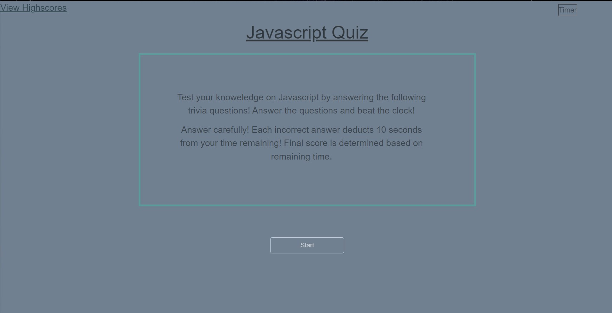

# Web APIs Challenge: Code Quiz

## Description
________

This weeks challenge is to build a timed coding quiz with multiple-choice questions.


## User Story
____________
```
AS A coding boot camp student
I WANT to take a timed quiz on JavaScript fundamentals that stores high scores
SO THAT I can gauge my progress compared to my peers
```

## Acceptance Criteria
___
```
GIVEN I am taking a code quiz
WHEN I click the start button
THEN a timer starts and I am presented with a question
WHEN I answer a question
THEN I am presented with another question
WHEN I answer a question incorrectly
THEN time is subtracted from the clock
WHEN all questions are answered or the timer reaches 0
THEN the game is over
WHEN the game is over
THEN I can save my initials and score
Mock-Up
```



## Git Hub
___

Please find the URL for the completed challenge: https://bdjs0033.github.io/Code_Quiz/

Please find the URL for the repository: https://github.com/BDJS0033/Code_Quiz
